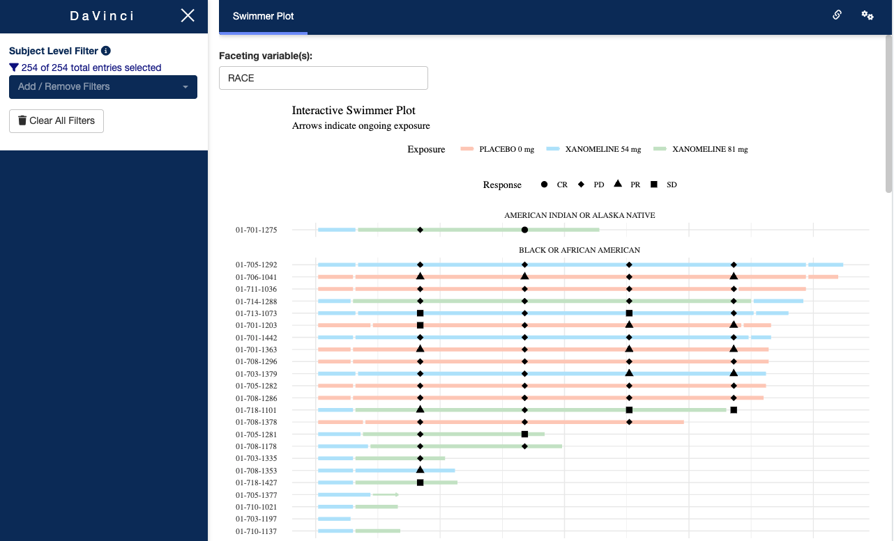

# dv.swimmerplot

{width=100%}

## Overview

The Swimmer Plot module from DaVinci's {dv.swimmerplot} package provides interactive visualization of subject-level treatment and response data over time. The module is designed to work with DaVinci's [{dv.manager}](https://boehringer-ingelheim.github.io/dv.manager/) package and supports its filtering functionality. The interactive plot includes tooltips with detailed information for both exposure periods and response points.

## Installation

You can install the development version of {dv.swimmerplot} from:

```r
if (!require("remotes")) install.packages("remotes")
remotes::install_github("Boehringer-Ingelheim/dv.swimmerplot")
```

See `vignette("dv-swimmerplot")` for further information on how to use {dv.swimmerplot} with [{dv.manager}](https://boehringer-ingelheim.github.io/dv.manager/) to create interactive swimmer plots
with SDTM data from {pharmaversesdtm}.
